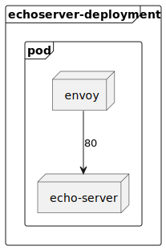

# 🔒 mTLS Tutorial

In this tutorial I am going to show how to configure mTLS for a service using [envoy][5].

## Minkube

This tutorial is going to use [minikube][1] to deploy the service. So make sure to have it installed, and your [`kubectl`][2] (with [`kustomize`][3]) is pointing to your minikube cluster.

<details>
    <summary>Run minikube</summary>

```shell
> minikube start
> kubectl config get-contexts
> kubectl config set-context minikube
```
</details>


## 🗣 Deployment An echo-server With mTLS 

### Generate certificate

We need to generate the **Certificate Authority, sign the server and client certificates**. 
We can use the provided script to generate the certificates by running:

```shell
> sh generate-ca-and-server-certs.sh
> sh generate-clients-certs.sh
```

After running the script, the following files should have been generated:

+ `ca.crt`: The Root Certificate Authority certificate, that is going to be used to verify the requests.
+ `cert.pem`: The intermediate certificate
+ `key.pem`: The private server key

+ `client.crt`: The client certificate
+ `client.key`: The client private key

### Deploy the echo-server/envoy

Let's deploy an [echo-server](https://hub.docker.com/r/ealen/echo-server), by running the following commands:

```shell
> kubectl apply -k ./echoserver
> minikube tunnel
```

This creates all the Kubernetes `resources` needed to deploy `echo-server/envoy` with mTLS. 

If everything is successful, we should have two endpoints available:
- [localhost:8082](http://localhost:8082): This endpoint does not have [mTLS][4] and it's just to check that the echo-server is deployed.
- [localhost:8080](http://localhost:8080): This endpoint is protected through mTLS and we should not be able to access it. You should not get a response at `localhost:8080` because we did not add the client certificates in our request.

To test the client certificates using [cURL][6]:

> curl -k -v --cacert <path_to_project>/echoserver/certs/ca.crt --cert <path_to_project>/echoserver/certs/client.crt --key <path_to_project>/echoserver/certs/client.key https://localhost:8080

### Echo-server Configuration

TODO: PlantUml of what it's deployed



## 📘 Resources

- [minikube][1]
- [kubectl][2]
- [kustomize][3]
- [mTLS][4]
- [envoy][5]
- [cURL][6]

[1]: https://minikube.sigs.k8s.io/docs/
[2]: https://kubernetes.io/docs/reference/kubectl/
[3]: https://kustomize.io/
[4]: https://en.wikipedia.org/wiki/Mutual_authentication
[5]: https://www.envoyproxy.io/
[6]: https://curl.se/
